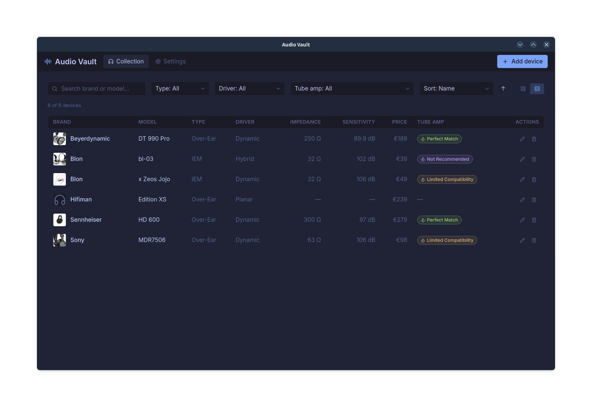
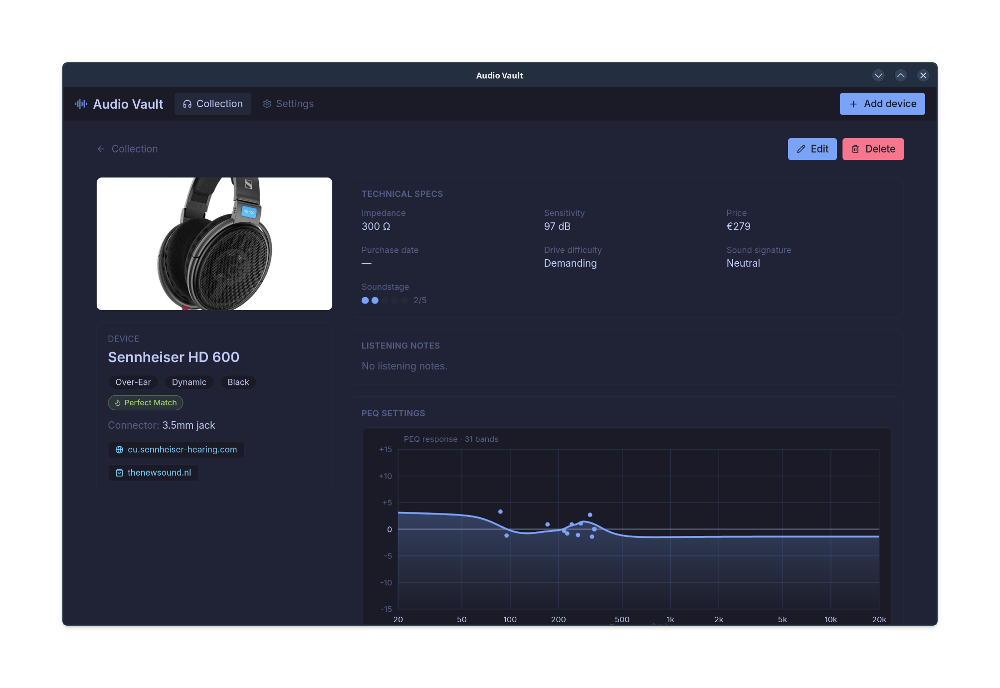

# Audio Vault


     

A local-first desktop application for audiophiles to manage a collection of
headphones, IEMs and source components (DACs, amps, AVRs). Built with [Tauri v2](https://tauri.app) (Rust) and
React + TypeScript, styled with Tailwind CSS in one of eight color
schemes (five dark — Tokyo Night default, Gruvbox Dark, Dracula,
Catppuccin Mocha, Monokai — and three light — Tokyo Day, Gruvbox Light,
Catppuccin Latte — switchable in Settings). The interface is available in English,
German, Dutch and French.

All data lives on this machine in XDG directories — nothing leaves it:

| What | Where |
| --- | --- |
| Database | `~/.local/share/audio-vault/collection.db` |
| Media (images, FR graphs; `.cache/` holds scaled copies) | `~/.local/share/audio-vault/media/` |
| Web-fetch caches (squig.link index) | `~/.local/share/audio-vault/cache/` |
| Config | `~/.config/audio-vault/config.json` |

## Screenshots

Collection overview (list view):



Device detail view:



## Features (Phase 1 / MVP)

- **Two categories:** Headphones (incl. IEMs) and Devices (DAC, AMP,
  Dongle DAC, DAC+AMP, BT Amp, Tube Amp, Power Amp, Preamp, Streamer,
  Phono Stage, Turntable, AVR), each with its own collection page,
  filters and spec fields (DAC chip, supported formats, Bluetooth
  codecs, inputs/outputs, amplifier specs, AVR extras); both categories
  carry a mood image (cover) plus a multi-image product gallery
  (front/back/details)
- Collection overview with grid, search, filters (type / driver / tube-amp
  compatibility) and sorting (name, added, modified, impedance, price)
- **Overall star rating** with half-star support (0.5–5), shown in the
  form, the detail view and both collection views
- **"The Sound"** section in the detail view: five rated attributes
  (soundstage, imaging, detail retrieval, timbre, tonal balance) scored
  with interactive half-dot inputs, each label carrying an info popover
  explaining what it is and how it sounds
- Device detail view: tech specs, The Sound, listening notes, PEQ response
  graph (OPRA-styled, with source attribution), frequency response graph,
  extra (custom) fields — empty sections stay hidden
- Add/Edit dialog organized like the detail view, with validation,
  image + FR-graph picking, autocomplete for brand / color / custom-field
  keys, and the PEQ section:
  - **OPRA preset lookup** (primary source): entering brand + model
    auto-checks the [OPRA](https://opra.roon.app) community-preset
    database (downloaded + cached in the background, ~13 MB); matching
    products list their presets (AutoEQ, oratory1990, …) as one-click
    apply buttons — attribution is stored with the device (CC BY-SA)
  - **File import** (fallback, offered only when OPRA has no match): FiiO
    DSP XML exports or JSON (bare band arrays, Audio Vault format, or
    OPRA-style entries)
- Tube-amp compatibility badge computed from impedance + driver type
  (override-able per device)
- Lightbox image viewer (full resolution; everything else uses cached
  downscaled copies — see below)
- **Fast image loading:** multi-MB originals are downscaled on first use
  and cached on disk (`media/.cache/`, Lanczos3, JPEG q82/PNG), so grids
  and cards load ~100 KB copies while the lightbox keeps full quality
- **Themed window chrome (Linux):** the native title bar is replaced by
  an in-app bar that matches the active color scheme exactly — drag to
  move, double-click to maximize, minimize/maximize/close controls
- Settings screen: language (EN/DE/NL/FR), currency, date format, color
  scheme, XDG paths, an "open media folder" action, and an About section
  showing the running app version
- Bundles: Linux (`.deb`, `.rpm`, `.AppImage`) and macOS (`.app`, `.dmg`), built via GitHub Actions CI

### Tube-amp compatibility rule

| Condition | Badge |
| --- | --- |
| Impedance ≥ 120 Ω | **Perfect Match** |
| 32–119 Ω + Dynamic driver | **Limited Compatibility** |
| 32–119 Ω + non-Dynamic driver | **Not Advised** |
| < 32 Ω | **Not Possible** |
| Impedance unknown | no badge |

Those are the display labels — the database stores the short codes (`Yes`, `OTL Only`, `Transformer Only`, `No`), so changing display names never requires a migration.

## Features (Phase 2 — Web auto-fetch)

A **Fetch specs** button in the add/edit dialog looks up the current
brand/model combination on the web and offers to fill the form — **only
empty fields are ever filled, user-entered values are never overwritten**.

| Field | Source |
| --- | --- |
| Frequency-response graph | squig.link measurement index (main + federated headphone databases). The raw REW measurement data is rendered in-app to a PNG (log-frequency axis, active theme colors) and stored in the media folder like any other image. |
| Price | squig.link phone-book entry |
| Driver type, impedance, sensitivity | Keyless DuckDuckGo web search → manufacturer/retailer pages parsed with lenient heuristics. |
| Product image | `og:image` from the first result page that provides one, downloaded into the media folder and added to the product-image gallery. |

Behaviour notes:

- **Best-effort and isolated.** Every step can fail independently; the
  result panel lists what was found plus notes for what couldn't be
  determined (and why). Nothing is ever saved automatically — you review
  the preview and press **Apply to form (empty fields only)**.
- **No match → blank fields.** If the device isn't in the squig.link index
  and the search doesn't yield specs, the form simply stays editable with
  whatever you typed.
- **Caching.** The squig.link phone books are cached under
  `~/.local/share/audio-vault/cache/` (24 h for the main index, 7 days for
  the federation list and federated books), so only the first lookup is
  slow.
- **Privacy.** Requests go out with a plain user agent (`AudioVault/0.3`)
  to squig.link, DuckDuckGo and the result pages. No API keys or
  credentials are needed or stored.
- FR data files use squig.link's REW text format (`frequency\tamp\tphase`);
  the left channel is preferred, with right-channel and channel-less
  fallbacks.

## Development

Prerequisites: Node.js, Rust, and the
[Tauri v2 Linux dependencies](https://tauri.app/start/prerequisites/)
(on Fedora: `webviewgtk2.0`, `libayatana-appindicator3`, etc.).

```sh
npm install

# Fedora build dependencies
sudo dnf install rpm-build gcc-c++ webkit2gtk4.1-devel openssl-devel librsvg2-devel

npm run tauri dev      # start the app in dev mode

# Build RPM + AppImage bundles.
# NO_STRIP=1 is required on current Fedora: system libraries use RELR
# (.relr.dyn) ELF sections that linuxdeploy's bundled strip cannot parse,
# which aborts AppImage bundling. Skipping strip only leaves debug symbols
# in the bundle (slightly larger AppImage).
NO_STRIP=1 npm run tauri build
```

The frontend type-checks and bundles with `npm run build`
(`tsc && vite build`); the Rust side with `cargo check` in `src-tauri/`.
Locale key parity across the four languages is enforced with
`npm run i18n:check`.

## Project layout

```text
app/
├── src/                    # React frontend
│   ├── App.tsx             # App shell: nav, view switching, dialogs
│   ├── types.ts            # Domain types + enum constants
│   ├── ui.ts               # Shared class names / helpers
│   ├── lib/
│   │   ├── paths.ts        # XDG path bootstrap (init_app_data)
│   │   ├── db.ts           # SQLite CRUD (tauri-plugin-sql)
│   │   ├── media.ts        # Image picking, asset URLs, scaled-copy resolution, cleanup
│   │   ├── tube.ts         # Tube-amp compatibility rule
│   │   ├── settings.ts     # Config access (theme, currency, dates)
│   │   ├── themes.ts       # Color schemes: tokens, chart palettes, applyTheme
│   │   ├── format.ts       # Price/date formatting helpers
│   │   ├── i18n.ts         # i18next setup, enum labels, note localization
│   │   ├── fetchSpecs.ts   # Phase 2: fetch/download command wrappers
│   │   ├── renderFr.ts     # Phase 2: FR curve → PNG (canvas) + SVG preview
│   │   ├── opra.ts         # Phase 3: OPRA lookup wrapper + band conversion
│   │   ├── parseFiioEq.ts  # Phase 3: FiiO DSP XML → bands
│   │   ├── peqImport.ts    # Phase 3: PEQ file dispatch (XML/JSON) + generic JSON parser
│   │   └── peqCurve.ts     # PEQ bands → combined magnitude curve + SVG model
│   └── components/
│       ├── CollectionView.tsx
│       ├── DateCalendar.tsx        # themed month-grid popover (purchase date)
│       ├── DeviceDetailView.tsx
│       ├── DeviceFormDialog.tsx  # incl. the "Web fetch" panel + OPRA PEQ section
│       ├── DotRating.tsx         # half-dot rating input (sound attributes)
│       ├── FrPreview.tsx         # fetched FR curve mini-chart (SVG)
│       ├── InfoTip.tsx           # hover/click info popover (The Sound labels)
│       ├── PeqGraph.tsx          # PEQ response graph (JSX, themed)
│       ├── SettingsView.tsx      # incl. the "Web fetch" info section
│       ├── StarRating.tsx        # half-star rating input (overall rating)
│       ├── TagInput.tsx          # chip multi-value input (inputs/outputs/codecs)
│       ├── Tip.tsx               # styled hover tooltip for badges/pills
│       ├── Lightbox.tsx
│       ├── MediaImage.tsx          # theme-aware  (asset URL, base64 fallback, maxDim scaling)
│       ├── Modal.tsx
│       ├── TitleBar.tsx          # Linux CSD: unified title/nav/window-controls bar
│       └── TubeBadge.tsx
└── src-tauri/              # Rust backend
    ├── src/
    │   ├── lib.rs          # Commands: init_app_data, media_copy_file,
    │   │                   #   media_delete, media_read_base64,
    │   │                   #   media_save_bytes, media_download_image,
    │   │                   #   media_scaled, open_media_folder,
    │   │                   #   read_config, save_config, fetch_specs,
    │   │                   #   fetch_opra_presets
    │   │                   #   + DB migrations (v1–v20; v9+ ratings, v14 doubles
    │   │                   #   sound ratings, v15 updated_at, v16+v17 devices
    │   │                   #   category, v18 images column, v19/v20 legacy
    │   │                   #   product images moved into the gallery)
    │   ├── fetch_specs.rs  # Phase 2: squig.link index matching, REW
    │   │                   #   parsing, web search, spec scraping
    │   └── fetch_opra.rs   # Phase 3: OPRA database download/cache, parse,
    │                       #   brand+model matching
    ├── tauri.conf.json     # Asset protocol scope, CSP, bundle targets
    ├── tauri.linux.conf.json  # Linux-only: decorations off (custom title bar)
    └── capabilities/default.json  # Tauri v2 plugin permissions (incl. window controls)
```

## License

Audio Vault is licensed under the [MIT License](LICENSE). Copyright (c) 2026 pbaart.

Some fetched data (OPRA community presets, squig.link measurements) carries its
own license (e.g., CC BY-SA 4.0); attribution is stored per device and shown in
the UI.
